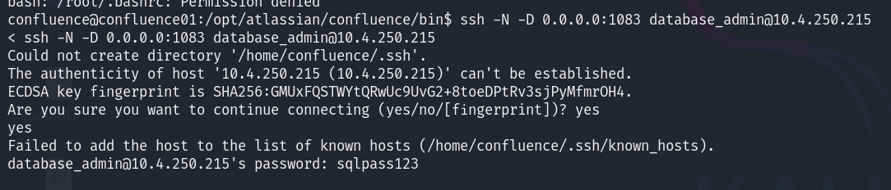
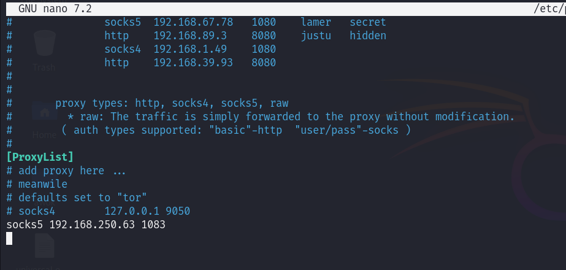
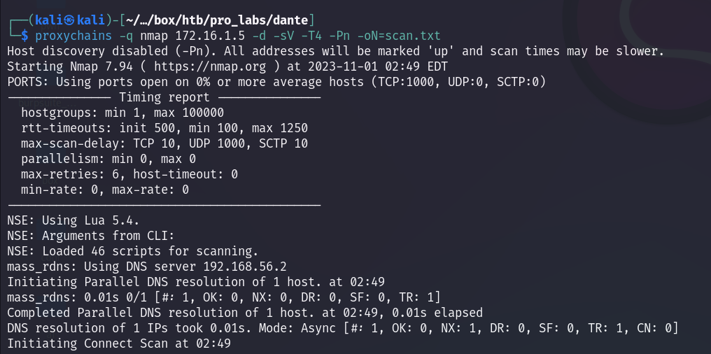

Use ssh to forward request to target via ssh
```
ssh -N -D 0.0.0.0:1083 database_admin@10.4.250.215
```


Setup proxychain conf


After that, simply use the command that we want (e.g, nmap)
```
proxychains -q nmap 172.16.1.5 -d -sV -T4 -Pn -oN=scan.txt (change the command to your liking)
```


Alternative command to port scanning without nmap
```
for port in {4800..4900}; do proxychains nc -zv -w1 172.16.250.217 $port 2>&1 | grep OK; done
```
