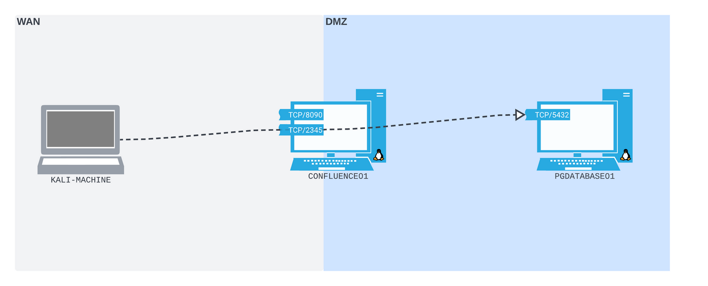
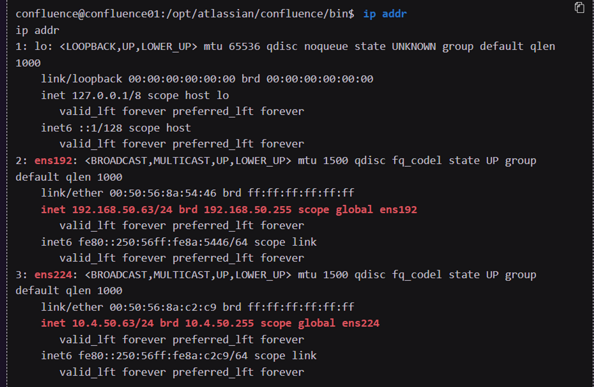
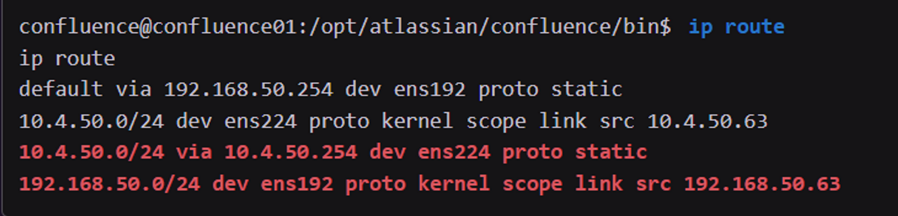
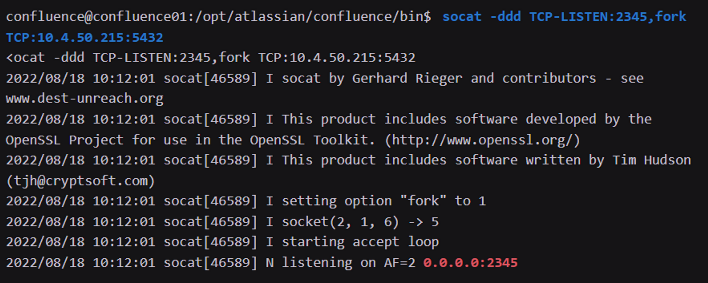
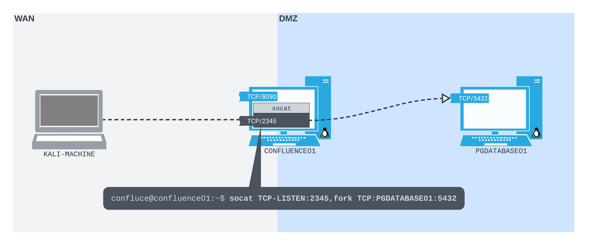
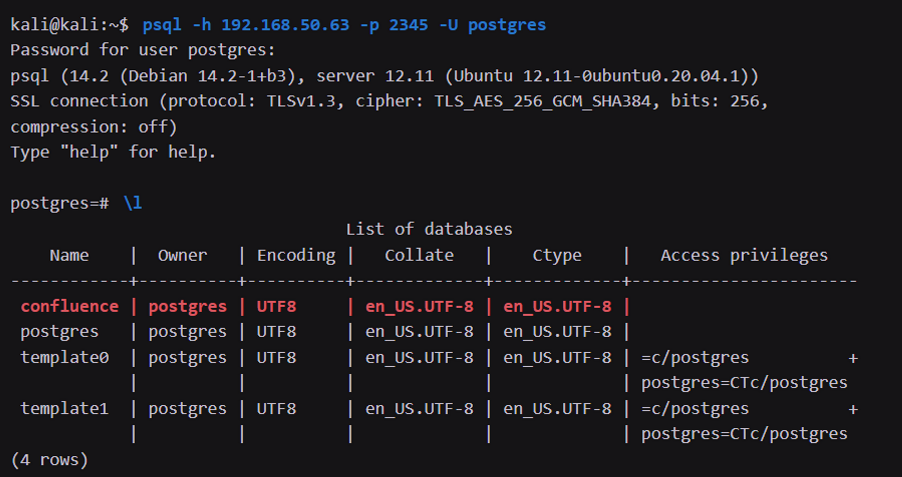
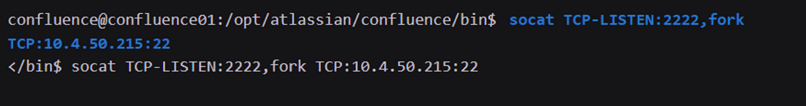
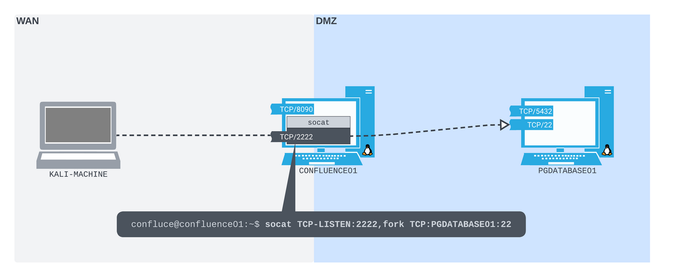
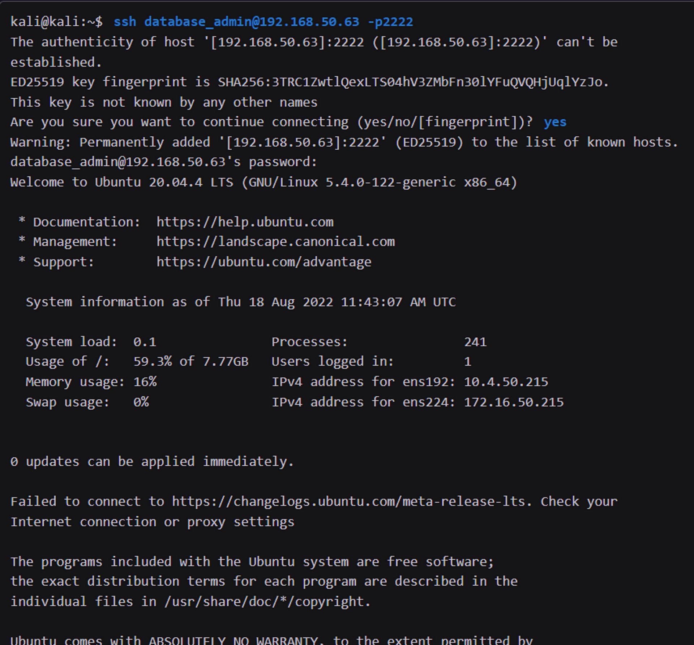

Concept illustration


Enum network interfaces


Enum routes


Run socat listener
```
socat -ddd TCP-LISTEN:2345,fork TCP:10.4.50.215:5432
```



Connect with the forwarded port


The same thing but with SSH


